# Log Aggregation & Analysis System

[](https://elastic.co)
[](https://elastic.co/logstash)
[](https://elastic.co/kibana)
[](https://elastic.co/beats/filebeat)
[](https://vector.dev)
[](https://grafana.com)
[](https://docker.com)
[](https://kubernetes.io)
[](https://elastic.co/what-is/elastic-stack-security)
[](LICENSE)

A comprehensive centralized logging solution using the ELK stack (Elasticsearch, Logstash, Kibana) with additional components for log processing, analysis, and alerting.

## Features

### Log Collection & Processing
- **Multi-source Log Collection**: Collect logs from applications, systems, containers, and cloud services
- **Real-time Processing**: Stream processing with Logstash and custom processors
- **Log Parsing & Enrichment**: Intelligent parsing, structure extraction, and metadata enrichment
- **Data Normalization**: Standardize log formats across different sources
- **Security Log Analysis**: Specialized processing for security events and audit logs

### Storage & Search
- **Elasticsearch Cluster**: Scalable, distributed search and analytics engine
- **Index Management**: Automated index lifecycle management with retention policies
- **Hot-Warm-Cold Architecture**: Cost-effective storage tiering
- **Search Optimization**: Optimized indices for fast querying and aggregations
- **Data Backup & Recovery**: Automated backup and disaster recovery procedures

### Visualization & Analytics
- **Kibana Dashboards**: Interactive dashboards for log visualization and analysis
- **Custom Visualizations**: Specialized charts and graphs for different log types
- **Real-time Monitoring**: Live log streaming and monitoring capabilities
- **Saved Searches**: Pre-built searches for common log analysis tasks
- **Report Generation**: Automated report generation for compliance and analysis

### Alerting & Monitoring
- **Real-time Alerts**: Alert on log patterns, error rates, and anomalies
- **Machine Learning Detection**: Anomaly detection using Elasticsearch ML features
- **Alert Correlation**: Intelligent correlation of related events
- **Escalation Policies**: Configurable alert escalation and routing
- **Integration**: Connect with PagerDuty, Slack, email, and other notification systems

## Architecture

### ELK Stack System Architecture

```mermaid
graph TB
    subgraph "Data Sources Layer"
        AppLogs["📱 Application Logs<br/>Web Apps • APIs • Services"]
        SysLogs["💻 System Logs<br/>OS • Syslog • Auth"]
        Containers["📦 Container Logs<br/>Docker • Kubernetes"]
        CloudServices["☁️ Cloud Services<br/>AWS • GCP • Azure"]
        SecurityLogs["🔒 Security Logs<br/>Firewalls • IDS • Auth"]
    end

    subgraph "Collection Layer"
        Filebeat["🚀 Filebeat<br/>Lightweight Log Shipper"]
        Fluentd["🌊 Fluentd<br/>Unified Logging Layer"]
        Vector["⚡ Vector<br/>High-Performance Router"]
        SyslogNG["📧 Syslog-NG<br/>System Log Daemon"]
    end

    subgraph "Processing Layer"
        Logstash["⚙️ Logstash<br/>Data Processing Pipeline"]
        Processors["🔄 Custom Processors<br/>Parsing • Enrichment"]
        Filters["🔍 Filters<br/>Grok • Mutate • Date"]
    end

    subgraph "Storage Layer - Hot/Warm/Cold"
        HotNodes[("🔥 Hot Nodes<br/>Recent Data (SSD)")]
        WarmNodes[("🌡️ Warm Nodes<br/>Older Data (SSD)")]
        ColdNodes[("❄️ Cold Nodes<br/>Archive Data (HDD)")]
        FrozenNodes[("🧊 Frozen Nodes<br/>Long-term (Object Store)")]
    end

    subgraph "Search & Analytics"
        MasterNodes["👑 Master Nodes<br/>Cluster Coordination"]
        DataNodes["📄 Data Nodes<br/>Indexing & Searching"]
        CoordNodes["📍 Coordinating Nodes<br/>Query Distribution"]
    end

    subgraph "Visualization Layer"
        Kibana["📈 Kibana<br/>Discovery • Dashboards"]
        Grafana["📊 Grafana<br/>Custom Dashboards"]
        APIs["🔗 Custom APIs<br/>Programmatic Access"]
        Reports["📋 Report Engine<br/>Scheduled Reports"]
    end

    subgraph "Alerting & Monitoring"
        ElastAlert["🚨 ElastAlert<br/>Rule-based Alerts"]
        Watcher["👁️ Elasticsearch Watcher<br/>Real-time Monitoring"]
        MLJobs["🤖 ML Jobs<br/>Anomaly Detection"]
        Notifications["📬 Notifications<br/>Slack • Email • PagerDuty"]
    end

    %% Data Flow
    AppLogs --> Filebeat
    SysLogs --> SyslogNG
    Containers --> Filebeat
    CloudServices --> Fluentd
    SecurityLogs --> Vector

    Filebeat --> Logstash
    Fluentd --> Logstash
    Vector --> Logstash
    SyslogNG --> Logstash

    Logstash --> Processors
    Processors --> Filters
    Filters --> HotNodes

    HotNodes --> WarmNodes
    WarmNodes --> ColdNodes
    ColdNodes --> FrozenNodes

    MasterNodes --> HotNodes
    MasterNodes --> WarmNodes
    DataNodes --> HotNodes
    CoordNodes --> DataNodes

    CoordNodes --> Kibana
    DataNodes --> Grafana
    DataNodes --> APIs
    APIs --> Reports

    DataNodes --> ElastAlert
    DataNodes --> Watcher
    DataNodes --> MLJobs
    ElastAlert --> Notifications
    Watcher --> Notifications
    MLJobs --> Notifications

    style AppLogs fill:#e3f2fd
    style Logstash fill:#f3e5f5
    style HotNodes fill:#ffebee
    style Kibana fill:#e8f5e8
```



### Log Processing Pipeline

```mermaid
sequenceDiagram
    participant LS as Log Sources
    participant FB as Filebeat
    participant LG as Logstash
    participant ES as Elasticsearch
    participant KB as Kibana
    participant AL as ElastAlert
    participant NT as Notifications

    LS->>FB: Raw log events
    FB->>FB: Buffer & batch logs
    FB->>LG: Ship to Logstash
    
    LG->>LG: Parse with Grok patterns
    LG->>LG: Enrich with metadata
    LG->>LG: Apply filters & transforms
    LG->>LG: Validate & normalize
    
    LG->>ES: Index processed logs
    ES->>ES: Store in hot nodes
    ES->>ES: Apply index templates
    ES->>ES: Update mappings
    
    KB->>ES: Query for visualizations
    ES->>KB: Return aggregated data
    KB->>KB: Render dashboards
    
    AL->>ES: Monitor log patterns
    ES->>AL: Stream matching events
    AL->>AL: Evaluate alert rules
    AL->>NT: Trigger notifications
    
    Note over ES: Index lifecycle:<br/>Hot → Warm → Cold → Delete
    Note over LG,ES: Logs buffered during<br/>ES unavailability
```



### Security & Compliance Architecture

```mermaid
flowchart TD
    A["🔍 Log Ingestion"] --> B["🔒 Authentication Check"]
    B --> C{"✅ Valid Credentials?"}
    
    C -->|No| D["❌ Access Denied"]
    C -->|Yes| E["📝 Authorization Check"]
    
    E --> F{"🔑 Required Permissions?"}
    F -->|No| D
    F -->|Yes| G["🎯 Data Classification"]
    
    G --> H{"🕵️ PII Detected?"}
    H -->|Yes| I["🎭 Data Masking"]
    H -->|No| J["⚙️ Process Logs"]
    
    I --> J
    J --> K["📋 Audit Logging"]
    K --> L["💾 Store in Elasticsearch"]
    
    L --> M["🔎 Access Control Check"]
    M --> N{"👥 User Role?"}
    
    N -->|Admin| O["📊 Full Access"]
    N -->|Analyst| P["🔍 Read-only Access"]
    N -->|Developer| Q["🔧 App-specific Logs"]
    
    O --> R["📈 Kibana Dashboard"]
    P --> R
    Q --> R
    
    R --> S["📋 Generate Audit Trail"]
    S --> T["📊 Compliance Reporting"]
    
    style A fill:#e3f2fd
    style G fill:#f3e5f5
    style L fill:#e8f5e8
    style T fill:#fff3e0
```



### Index Lifecycle Management (ILM)


## Components

### Core Stack
- **Elasticsearch**: Distributed search and analytics engine
- **Logstash**: Server-side data processing pipeline
- **Kibana**: Data visualization and exploration platform
- **Filebeat**: Lightweight log shipper

### Additional Components
- **Curator**: Index lifecycle management
- **ElastAlert**: Rule-based alerting for Elasticsearch
- **Grafana**: Additional visualization and alerting capabilities
- **Vector**: High-performance log router and processor
- **Log Analysis API**: Custom REST API for programmatic log access

### Security & Compliance
- **X-Pack Security**: Authentication, authorization, and encryption
- **Audit Logging**: Comprehensive audit trail for compliance
- **Data Masking**: PII and sensitive data protection
- **RBAC**: Role-based access control for different user types

## Quick Start

### Prerequisites
- Docker and Docker Compose
- At least 8GB RAM available
- 50GB+ disk space for log storage
- Kubernetes cluster (for production deployment)

### Development Setup

1. Clone and start the stack:
```bash
git clone <repository-url>
cd log-aggregation-system
docker-compose up -d
```

2. Access the interfaces:
- Kibana: http://localhost:5601
- Elasticsearch: http://localhost:9200
- Grafana: http://localhost:3000

3. Configure log shipping:
```bash
# Configure Filebeat for your log sources
cp configs/filebeat/filebeat.example.yml configs/filebeat/filebeat.yml
# Edit the configuration for your environment
docker-compose restart filebeat
```

### Production Deployment

1. Deploy to Kubernetes:
```bash
kubectl apply -f deployment/kubernetes/
```

2. Configure ingress and SSL certificates
3. Set up monitoring and alerting
4. Configure backup procedures

## Configuration

### Log Sources Configuration
```yaml
# filebeat.yml
filebeat.inputs:
- type: log
  paths:
    - /var/log/app/*.log
  fields:
    service: myapp
    environment: production
    
- type: container
  paths:
    - /var/lib/docker/containers/*/*.log
```

### Logstash Processing
```ruby
# logstash.conf
filter {
  if [service] == "webapp" {
    grok {
      match => { "message" => "%{TIMESTAMP_ISO8601:timestamp} %{LOGLEVEL:level} %{GREEDYDATA:msg}" }
    }
    date {
      match => [ "timestamp", "ISO8601" ]
    }
  }
}
```

### Index Templates
```json
{
  "index_patterns": ["logs-*"],
  "template": {
    "settings": {
      "number_of_shards": 1,
      "number_of_replicas": 1,
      "index.lifecycle.name": "logs-policy"
    }
  }
}
```

## Technology Stack

- **Search & Analytics**: Elasticsearch 8.x
- **Data Processing**: Logstash 8.x, Vector
- **Visualization**: Kibana 8.x, Grafana
- **Log Shipping**: Filebeat, Fluentd
- **Container Orchestration**: Docker, Kubernetes
- **Monitoring**: Prometheus, custom metrics
- **Storage**: SSD storage with hot-warm-cold tiering

## Performance & Scaling

### Resource Requirements
- **Development**: 4GB RAM, 2 CPU cores, 20GB storage
- **Production**: 16GB+ RAM, 8+ CPU cores, 500GB+ storage
- **Enterprise**: Multi-node cluster with dedicated roles

### Scaling Guidelines
- **Elasticsearch**: Scale horizontally by adding data nodes
- **Logstash**: Scale by adding more pipeline workers
- **Storage**: Implement hot-warm-cold architecture for cost optimization

## Security

### Authentication & Authorization
- X-Pack Security with LDAP/SAML integration
- Role-based access control (RBAC)
- API key management for programmatic access

### Data Protection
- Encryption in transit and at rest
- Field-level security for sensitive data
- Audit logging for all access and modifications

### Network Security
- TLS encryption for all communications
- Network segmentation and firewall rules
- VPN or private network access

## Monitoring & Alerting

### System Health
- Cluster health monitoring
- Index health and performance metrics
- Resource utilization tracking
- Log ingestion rates and delays

### Log-based Alerts
- Error rate thresholds
- Security event detection
- Performance anomalies
- Custom business logic alerts

## Maintenance

### Index Management
- Automated index rotation
- Retention policy enforcement
- Performance optimization
- Storage cleanup

### Backup & Recovery
- Automated daily snapshots
- Cross-region backup replication
- Disaster recovery procedures
- Data integrity verification

## Contributing

1. Fork the repository
2. Create a feature branch
3. Test changes in development environment
4. Submit a pull request with detailed description

## License

MIT License - see LICENSE file for details

---

**Created by [olaitanojo](https://github.com/olaitanojo)**
